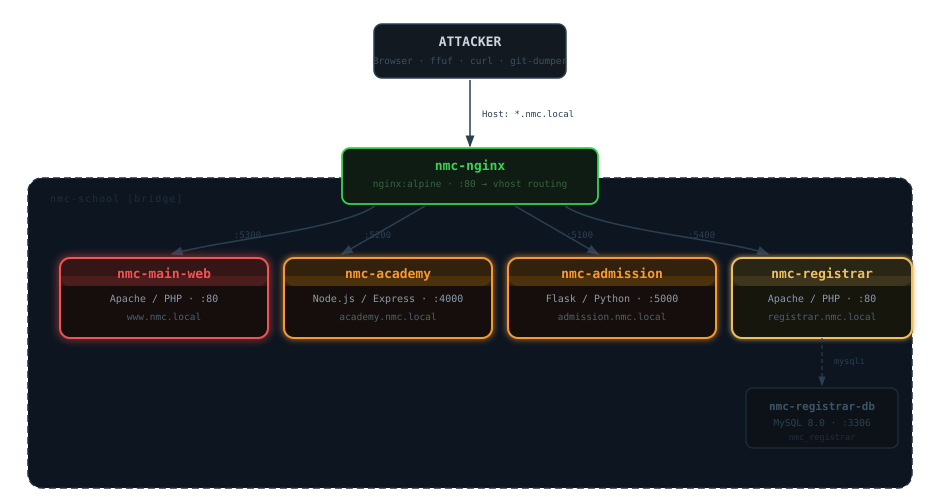

# Northern Metro College — Lab



> Multi-app environment simulating the internal web systems of Northern Metro College.

**For authorized security research and educational use only.**

---

## Quick Start

**Requirements:** Docker + Docker Compose v2

**Step 1 — Clone and run**

```bash
git clone https://github.com/ruur31337/nmc-lab.git
cd nmc-lab
docker compose up -d
```

**Step 2 — Add to `/etc/hosts`**

Linux / Mac:

```bash
echo "127.0.0.1 www.nmc.local academy.nmc.local admission.nmc.local registrar.nmc.local" | sudo tee -a /etc/hosts
```

Windows — open `C:\Windows\System32\drivers\etc\hosts` as Administrator and add:

```
127.0.0.1  www.nmc.local  academy.nmc.local  admission.nmc.local  registrar.nmc.local
```

**Step 3 — Open a browser and start**

All apps are on **port 80** via their domain name. No port numbers needed.

---

## Targets

| App | URL | Stack |
|-----|-----|-------|
| Main Website | `http://www.nmc.local` | Apache / PHP |
| Academy Portal | `http://academy.nmc.local` | Node.js / Express |
| Admission Portal | `http://admission.nmc.local` | Python / Flask |
| Registrar System | `http://registrar.nmc.local` | Apache / PHP / MySQL |

---

## Endpoints

### www.nmc.local — Main Website
- `/` — company homepage
- `/careers.php` — careers page with file upload
- `/about.php`, `/contact.php` — static pages

### academy.nmc.local — Academy Portal
- `/` — login page
- `/api/auth/login` — authentication
- `/api/auth/forgot-password` — password reset
- `/api/announcements` — announcements feed
- `/api/inbox/:id` — inbox messages
- `/api/users/me` — profile

### admission.nmc.local — Admission Portal
- `/` — admission application portal
- `/login` — applicant login
- `/dashboard` — application status

### registrar.nmc.local — Registrar System
- `/` — public homepage with announcements
- `/apply.php` — document request form
- `/track.php` — request tracking
- `/staff/login.php` — staff portal
- `/staff/search.php` — student search
- `/staff/view_request.php` — request management

---

## Updating

To pull the latest images and restart:

```bash
docker compose pull
docker compose down
docker compose up -d
```

---

## Stopping the Lab

```bash
docker compose down
```

---

## Notes

- All applications are intentionally vulnerable — do not expose to the internet
- Tested on Docker 24+ with Docker Compose v2
- Default network: `nmc-school` (bridge, internal only)
- The registrar database is pre-seeded with realistic student records, grades, and document requests
